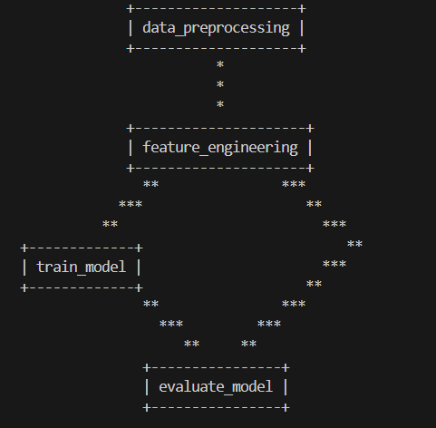
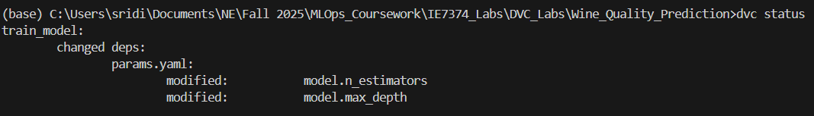
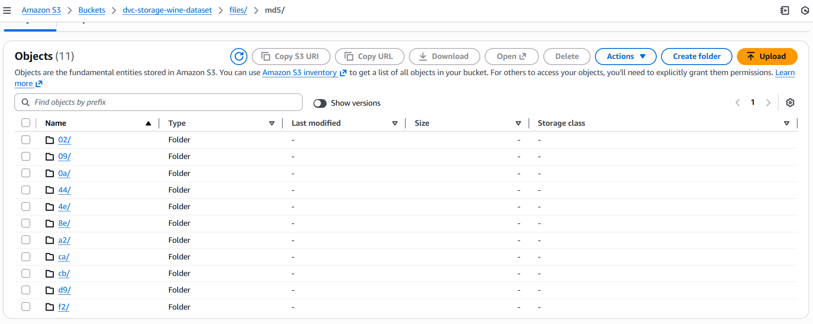

# DVC Machine Learning Pipeline - Wine Quality Prediction

A hands-on lab for learning DVC (Data Version Control) with a machine learning pipeline that predicts wine quality using the UCI Wine Quality dataset.

## 📋 Project Overview

This project demonstrates:
- **Data versioning** with DVC
- **Pipeline automation** with reproducible stages
- **Experiment tracking** with parameters and metrics
- **Collaboration** workflows with Git and DVC

## 🏗️ Project Structure

```
Wine_Quality_Prediction/
├── data/
│   ├── raw/              # Raw data (tracked by DVC)
│   ├── processed/        # Preprocessed data (tracked by DVC)
│   └── features/         # Engineered features (tracked by DVC)
├── models/
│   ├── model.pkl         # Trained model (tracked by DVC)
│   └── artifacts/        # Model artifacts like scaler
├── metrics/              # Metrics JSON files
├── plots/                # Evaluation plots
├── data_preprocessing.py
├── feature_engineering.py
├── train_model.py
├── evaluate_model.py
├── params.yaml           # Hyperparameters
├── dvc.yaml              # DVC pipeline definition
├── requirements.txt
└── README.md
```

## 🚀 Step-by-Step Setup Instructions

### Step 1: Prerequisites

Ensure you have:
- Python 3.8 or higher
- Git installed
- pip package manager

### Step 2: Create Project Directory

```bash
# Create and navigate to project directory
mkdir Wine_Quality_Prediction
cd Wine_Quality_Prediction
```

### Step 3: Initialize Git Repository

```bash
# Initialize Git
git init
```

### Step 4: Create Virtual Environment

```bash
# Create virtual environment
python -m venv venv

# Activate virtual environment
# On Windows:
venv\Scripts\activate
# On macOS/Linux:
source venv/bin/activate
```

### Step 5: Install Dependencies

Create `requirements.txt` file and install:

```bash
pip install -r requirements.txt
```

### Step 6: Initialize DVC

```bash
# Initialize DVC in your project
dvc init

# Commit DVC initialization
git add .dvc .dvcignore
git commit -m "Initialize DVC"
```

### Step 7: Create All Python Files

Create the following files with the provided code:
1. `data_preprocessing.py`
2. `feature_engineering.py`
3. `train_model.py`
4. `evaluate_model.py`
5. `params.yaml`
6. `dvc.yaml`
7. `.gitignore`

### Step 8: Configure Git to Track Code Only

```bash
# Add .gitignore
git add .gitignore
git commit -m "Add .gitignore"

# Add all Python scripts and config files
git add *.py params.yaml dvc.yaml requirements.txt README.md
git commit -m "Add ML pipeline code"
```

## 🔄 Running the DVC Pipeline

### Option 1: Run the Entire Pipeline

```bash
# Run all stages in order
dvc repro
```

This command will:
1. Check for changes in dependencies
2. Run only the stages that need to be updated
3. Track all outputs automatically

Note: I faced issue with Windows path length issue with DVC's cache system. Hence configured DVC cache path as:
```bash
dvc cache dir C:\dvc-cache
```

### Option 2: Run Individual Stages

```bash
# Run only data preprocessing
dvc repro data_preprocessing

# Run only training
dvc repro train_model

# Run only evaluation
dvc repro evaluate_model
```

### View Pipeline DAG

```bash
# Visualize the pipeline structure
dvc dag
```

Output:


## 📊 Viewing Results

### Check Metrics

```bash
# Show all tracked metrics
dvc metrics show

# Show metrics with differences from previous run
dvc metrics diff
```

### View Plots

After running the pipeline, check the `plots/` directory:
- `confusion_matrix.png` - Model confusion matrix
- `roc_curve.png` - ROC curve with AUC score
- `feature_importance.png` - Top feature importances
- `prediction_distribution.png` - Prediction probability distributions

### Check Pipeline Status

```bash
# Check which stages need to be run
dvc status
```
Output:


## 🧪 Experiment Tracking

### Modify Parameters

Edit `params.yaml` to try different hyperparameters:

```yaml
model:
  n_estimators: 200    # Tried different values
  max_depth: 15        # Tried different depths
  random_state: 42
```

### Run Experiment

```bash
# Run with new parameters
dvc repro

# Compare metrics with previous run
dvc metrics diff
```

### Track Experiments

```bash
# Create a Git tag for this experiment
git add params.yaml dvc.lock
git commit -m "Experiment: n_estimators=200, max_depth=15"
git tag -a exp-v1 -m "First experiment"
```

## 🔍 Understanding DVC Commands

### `dvc init`
Initializes DVC in your project. Creates `.dvc/` directory and `.dvcignore` file.

### `dvc repro`
Reproduces the pipeline. Only runs stages that have changed dependencies or parameters.

### `dvc dag`
Shows the pipeline structure as a directed acyclic graph (DAG).

### `dvc metrics show`
Displays all metrics tracked in the pipeline.

### `dvc metrics diff`
Compares metrics between the current run and the previous run.

### `dvc status`
Shows which stages are out of date and need to be run.

### `dvc push` / `dvc pull`
Push/pull data and models to/from remote storage (requires remote setup).

## 🌐 Setting Up Remote Storage (experimental)

Tried DVC support for AWS S3 remote storage:

### AWS S3 Remote

```bash
# Add S3 remote
dvc remote add -d myremote s3://my-bucket/path

# Configure credentials
dvc remote modify myremote access_key_id 'your-key'
dvc remote modify myremote secret_access_key 'your-secret'

# Push data
dvc push
```
Output of S3 storage:


## 🤝 Collaboration Workflow

### Sharing Your Pipeline

```bash
# Commit DVC files
git add dvc.yaml dvc.lock .gitignore
git commit -m "Add ML pipeline"

# Push to Git (code only)
git push origin main

# Push data to DVC remote
dvc push
```

### Cloning and Reproducing

```bash
# Clone repository
git clone <your-repo-url>
cd dvc-ml-pipeline

# Pull data from DVC remote
dvc pull

# Reproduce pipeline
dvc repro
```

## 🎯 Key Learning Points

1. **Separation of Concerns**: Git tracks code, DVC tracks data and models
2. **Reproducibility**: Anyone can reproduce your results with `dvc repro`
3. **Efficiency**: DVC only reruns changed stages
4. **Versioning**: Track experiments with Git tags and compare metrics
5. **Collaboration**: Share large files efficiently with remote storage


This project is for educational purposes as part of a DVC learning lab.

---

**Happy Learning! 🚀**