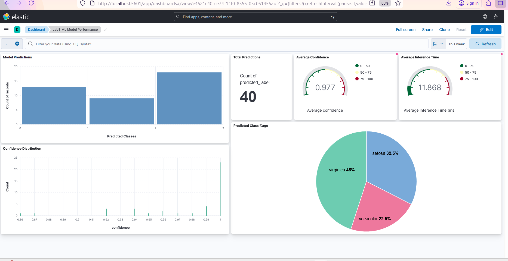

# ML Model Monitoring with ELK Stack using Docker

This MLOps project demonstrate a real-time machine learning model performance monitoring using Elasticsearch, Logstash, and Kibana with Docker.

## Architecture

- **Elasticsearch**: Stores and indexes ML prediction logs
- **Logstash**: Processes and transforms prediction data
- **Kibana**: Visualizes model performance metrics
- **ML App**: Generates predictions using scikit-learn iris classifier

## Quick Start

1. Clone this repository
2. Open PowerShell/Command Prompt in the project directory
3. Start the stack:
```
   docker-compose up -d
```
4. Wait 2-3 minutes for all services to start
5. Access Kibana: http://localhost:5601

## Creating and Viewing Dashboards

1. Open Kibana at http://localhost:5601
2. Go to Management → Stack Management → Kibana → Data Views
3. Create a data view with index pattern: `ml-predictions-*`
4. Set time field: `@timestamp`
5. Go to Analytics → Visualize library; create visualizations and dashboard


## Sample Queries

- Total predictions: Count of documents
- Accuracy rate: Average of `prediction_correct`
- Average confidence: Average of `confidence`
- Inference time: Average of `inference_time_ms`

## Stopping the Stack
```
docker-compose down
```

To remove all data:
```
docker-compose down -v
```