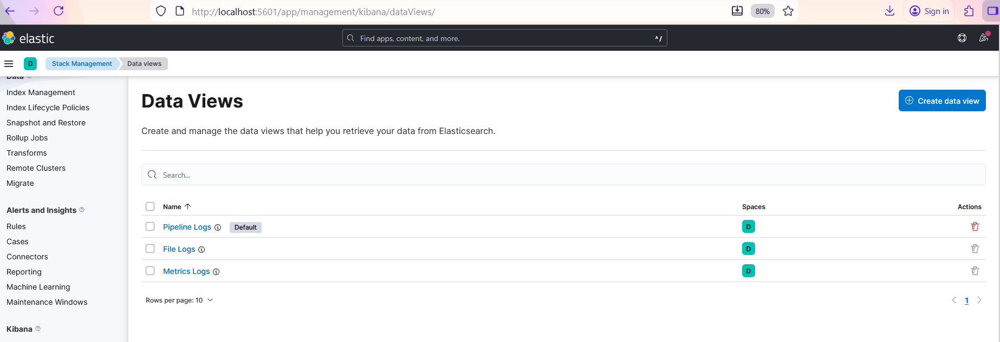
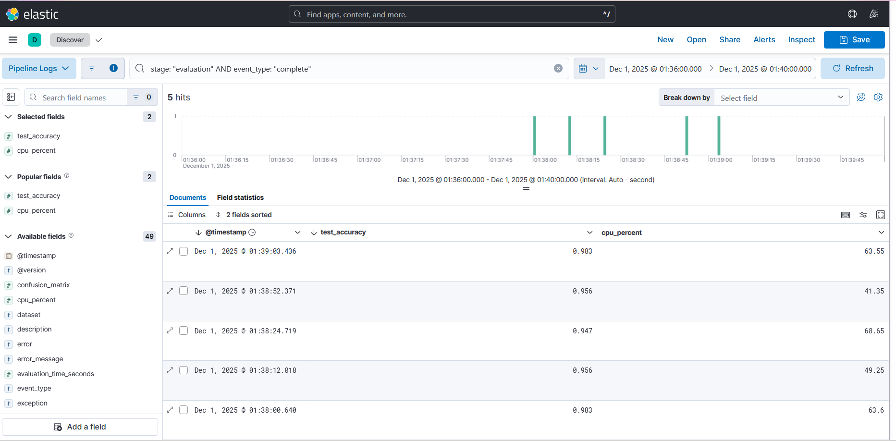
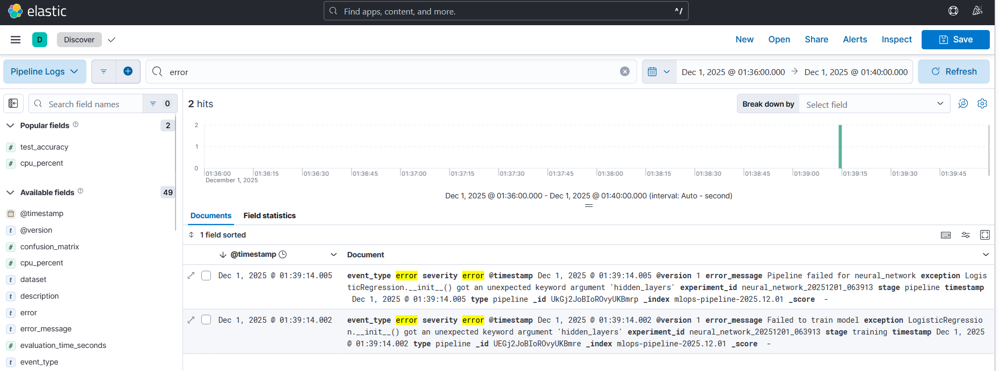
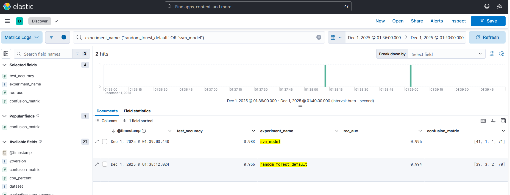

# MLOps Training Pipeline Monitoring with ELK Stack (using Docker)

This is a complete MLOps project demonstrating ML experiment tracking, pipeline monitoring, and performance metrics visualization using the ELK stack.

## Features

- **Multiple ML Experiments**: Run and compare 6 different models
- **Real-time Pipeline Monitoring**: Track every stage (data loading, preprocessing, training, evaluation)
- **Performance Metrics**: Log accuracy, F1-score, precision, recall, ROC-AUC
- **Resource Utilization**: Monitor CPU and memory usage
- **Model Comparison**: Compare models side-by-side
- **Error Tracking**: Capture and analyze pipeline failures

## Architecture
```
Training Pipeline → Logstash → Elasticsearch → Kibana
       ↓
   File Logs → Filebeat → Elasticsearch
```

## Models Included

1. Logistic Regression (Baseline)
2. Random Forest (Default)
3. Random Forest (Tuned)
4. Gradient Boosting
5. Support Vector Machine
6. Neural Network

## Quick Start
1. Clone this repository
2. Open PowerShell/Command Prompt in the project directory
3. Start ELK Stack
```powershell
docker-compose up -d
```
4. Monitor Progress
```powershell
# Watch training pipeline logs
docker logs -f training_pipeline

# Check all services
docker-compose ps
```
5. Access Kibana

Open browser: `http://localhost:5601`

Wait 2-3 minutes for Kibana to initialize.

## Kibana Setup

### Create Index Patterns

1. **Pipeline Logs**:
   - Go to Management → Stack Management → Kibana → Data Views
   - Create a data view
      - Name: `Pipeline Logs`
      - Index Pattern: `ml-predictions-*`     
      - Time field: `@timestamp`
   - Click "Create"

2. **Metrics Logs**:   
   - Create another data view
      - Name: `Metrics Logs`
      - Index Pattern: `mlops-metrics-*`
      - Time field: `@timestamp`
   - Click "Create"

3. **File Logs**:
   - Create another data view
      - Name: `File Logs`
      - Index Pattern: `mlops-logs-*`
      - Time field: `@timestamp`
   - Click "Create"



## Dashboard Visualization

### Model Comparison Dashboard


## Running Sample Queries in Discover

Go to Analytics → Discover and run these sample queries:

### Find Best Performing Model
```
stage: "evaluation" AND event_type: "complete"
```
Sort by `test_accuracy` descending

**Output:**


### Find Training Errors
```
event_type: "error"
```
**Output:**


### Compare Specific Models
```
experiment_name: ("random_forest_default" OR "svm_model")
```
**Output:**



## Project Structure
```
mlops-pipeline-elk/
├── docker-compose.yml                 # Orchestrates all services
├── logstash/
│   ├── config/logstash.yml           # Logstash configuration
│   └── pipeline/
│       ├── training-pipeline.conf    # Pipeline logs processing
│       └── metrics-pipeline.conf     # Metrics logs processing
├── filebeat/
│   └── filebeat.yml                  # File log shipping
├── kibana/
│   └── kibana.yml                    # Kibana configuration
└── training_pipeline/
    ├── config/experiments.yaml       # Experiment definitions
    ├── src/                          # Pipeline components
    └── pipeline.py                   # Main pipeline orchestrator
```

## Stopping the Stack
```powershell
# Stop all services
docker-compose down

# Remove all data
docker-compose down -v
```

## Extending the Project

### Add More Models

Edit `config/experiments.yaml` to add new experiments.

### Use Different Datasets

Modify `run_experiments.py` to use 'wine' or 'digits' datasets.

### Add Custom Metrics

Extend `evaluator.py` to calculate additional metrics.

### Integrate MLflow

Add MLflow for model registry alongside ELK monitoring.

## Learning Outcomes

From this project, the aim is to learn:

✓ ELK stack deployment with Docker
✓ Structured logging for ML pipelines
✓ Real-time experiment tracking
✓ Performance monitoring and visualization
✓ Model comparison techniques
✓ Resource utilization analysis
✓ Error tracking in ML workflows

